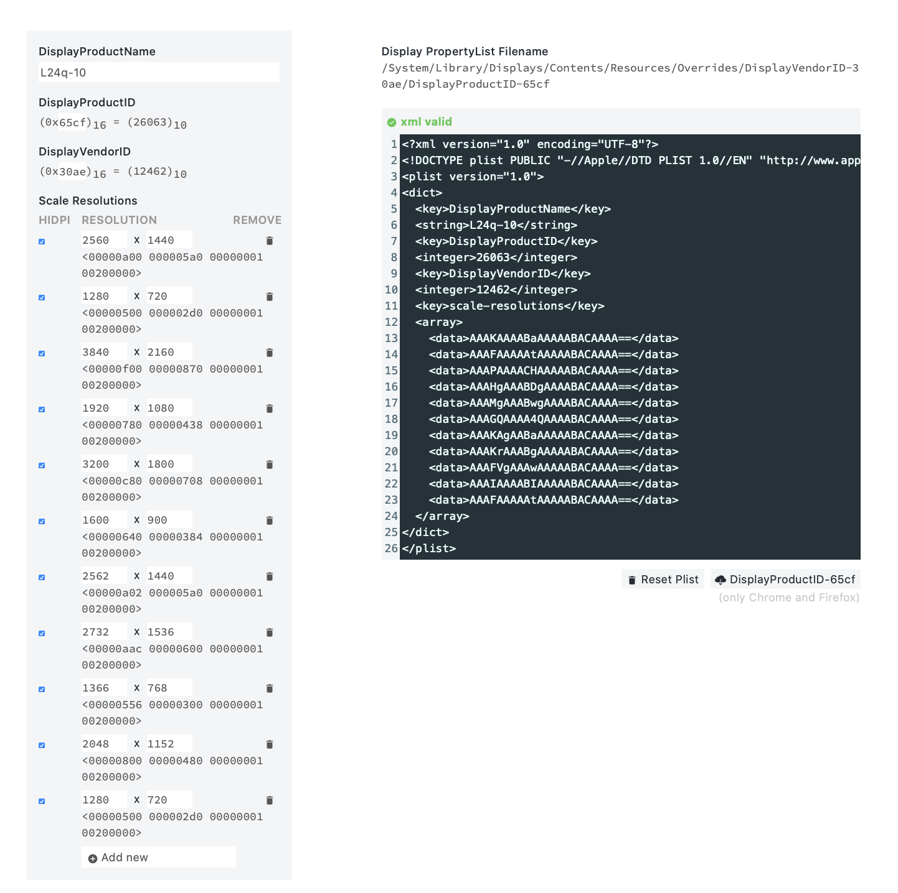

# Habilitar modo HiDPI en MacOS

Hace un tiempo me compré un monitor Lenovo con resolución 2K (2560x1440). La sorpresa vino al conectar el monitor a mi MacBook Pro Retina de 2015... todo se veía extremadamente pequeño en el monitor y para ser un monitor de alta resolución, se veía francamente mal, vamos como los monitores "FullHD" integrados en la mayoría de ordenadores portátiles hoy en día, bueno... creo que la sensación era incluso peor. 

Una de las cosas que yo valoro mucho en un ordenador portátil es la pantalla, aunque... por lo que parece muchas marcas no lo tienen tanto en cuenta. Quizá me he acostumbrado a la pantalla retina del MacBook y es por eso que me he vuelto un poco exquisito... cuando pasas tantas horas al día delante del ordenador agradeces que su pantalla tenga una resolución "agradable", créeme que más tarde la vista te lo agradece.

Bueno... vamos al grano, ya vale de criticar!

¿Qué está pasando? ¿Qué es eso de la resolución? ¿por qué no 4K en lugar de 2K?

Supongo que todos conocemos la importancia de la resolución de pantalla en un televisor, las empresas que fabrican televisores lo saben y se aprovechan de ello usando técnicas de marketing. No he hablado de las pulgadas de mi monitor... bueno pues es de 24 pulgadas, no está mal, mmm... ¿pero... por qué no más grande? Pues para un monitor digamos que "el tamaño no importa" de cierta forma.

Esto es muy importante y puede que ya lo sepas pero... hay una FUERTE relación entre la resolución de pantalla y las dimensiones de ésta. Existe un número clave que es el ppi (Pixels Per Inch) o píxeles por pulgada. El número ppi depende de la rasolución y las pulgadas de la pantalla, es decir, en una pantalla de 24 pulgadas con resolución 2K obtendremos un mayor ppi que en una de 32 pulgadas con la misma resolución, obvio, ¿no? 

A esto me refería con las técnicas de marketing, que es fácil encontrar televisores desde las 43 pulgadas a las 60 con resoluciones 4K, pero no es tan fácil (ni tan barato) encontrar televisores 4K de 32 o menos pulgadas. Pues, ¿la última pregunta es fácil de responder no? Hay muy poco mercado de monitores de 24 pulgadas con 4K o 2K ya que en un monitor de estas dimensiones, aumentar la resolución implica aumentar drásticamente el ppi, o lo que es lo mismo, aumento en los costes de producción... en resumen, lo que interesa es hacer publicidad de televisores 4K de grandes pulgadas porque es lo que sale más barato para las empresas y lo que parece más llamativo o mejor para los clientes, aunque luego no lo sea.


## La pantalla Retina de Apple

Las pantallas "Retina" incorporadas en los dispositivos de Apple lucen bastante bien, de hecho, la pantalla de mi MacBook de 2015, en mi opinión es de las mejores pantallas que he visto en un ordenador portátil. La mayoría de portátiles de 2020 vienen con pantallas Full HD mientras que los MacBook Pro de 2015 ya venían con una pantalla con exactamente el doble de resolución. 

Una alta resolución de pantalla normalmente implica que el tamaño de los iconos, ventanas y texto se vea bastante reducido, como pasaría en el MacBook con su pantalla 2K... prácticamente no veríamos el texto, sería enano a no ser que... la tecnología Retina diera con una especie de solución o una técnica que para nada tiene misterios. Lo que hace Apple con sus pantallas Retina es aumentar o escalar la resolución de forma que el usuario ve una resolución menor (escalada) con más píxeles por pulgada, lo que se traduce en una mayor nitidez de imagen que hace que prácticamente el ojo humano no pueda ver los píxeles a más de 15 cm de la pantalla. 

Todo esto está muy bien pero... ¿qué pasa si conectamos una pantalla externa al portátil? pues lo que puede pasar es que se utilice la resolución por defecto del monitor, y si esta resolución es 2K o 4K pues las cosas se van a ver muuuuy pequeñitas, esto es debido a que probablemente no sea compatible el modo HiDPI que básicamente es el sistema que utilizan las pantallas "Retina" para realizar este escalado de resolución que acabo de comentar.


## Cómo hablilitar el modo HiDPI

Vamos a activar el modo HiDPI para el monitor externo. Para seguir con los pasos a continuación, debes ser administrador del sistema o tener priviliegios para ejecutar comandos como admiistrado en una terminal.

### Habilitar modo HiDPI
1) Abrimos la aplicación "Terminal".
2) El siguiente comando habilita el modo HiDPI (debes copiarlo y pegarlo en la terminal que has abierto).
`sudo defaults write /Library/Preferences/com.apple.windowserver.plist DisplayResolutionEnabled -bool true`

### Añadir resoluciones HiDPI
Ahora vamos a añadir las resoluciones que queremos usar en modo HiDPI, para ello debemos generar un fichero en el que se incluirá alguna información necesaria sobre el monitor y sobre las resoluciones. 

1) Ejecutamos el comando en la terminal:
`ioreg -lw0 | grep IODisplayPrefsKey`

2) Debería aparecer algo parecido a...
```markdown
"IODisplayPrefsKey" = "IOService:/AppleACPIPlatformExpert/PCI0@0/AppleACPIPCI/IGPU@2/AppleIntelFramebuffer@0/display0/AppleBacklightDisplay-610-a029"
"IODisplayPrefsKey" = "IOService:/AppleACPIPlatformExpert/PCI0@0/AppleACPIPCI/IGPU@2/AppleIntelFramebuffer@2/display0/AppleDisplay-30ae-65cf"
```

Todos los monitores externos se identifican con _AppleDisplay_ y los internos con _AppleBacklightDisplay_. Para seleccionar el monitor externo debemos quedarnos con la línea que que contenga _AppleBacklightDisplay_:
```markdown
"IODisplayPrefsKey" = "IOService:/AppleACPIPlatformExpert/PCI0@0/AppleACPIPCI/IGPU@2/AppleIntelFramebuffer@2/display0/AppleDisplay-30ae-65cf"
```
3) Nos fijamos en el fragmento a partir de la última barra diagonal, en mi caso: `AppleDisplay-30ae-65cf`

4) De este fragmento nos quedamos con los valores después del primer guión, en mi caso: `30ae-65cf`

Estos valores tienen un significado: DisplayProductID: `65cf`, DisplayVendorID: `30ae`. Nos servirán ahora para editar el fichero correspondiente.

5) Ahora vamos a generar el fichero de resoluciones. Accedemos a [esta web](https://codeclou.github.io/Display-Override-PropertyList-File-Parser-and-Generator-with-HiDPI-Support-For-Scaled-Resolutions/) para generar el fichero. Debemos rellenar la tabla de la izquierda con la información que acabamos de obtener del monitor. Necesitamos conocer el DisplayVendorID y el DisplayProductID. Seguidamente vamos a ir eliminando o añadiendo resoluciones en la tabla. Yo me he basado en las resoluciones que me permite seleccionar para mi monitor desde Ajustes > Pantallas marcando el botón "Escalado".

6) Una vez terminemos de editar la tabla, descargamos el fichero, hay un botón en la web al lado de "Reset Plist"



7) En este punto ya debemos tener el fcihero descargado en la carpeta elegida para la descarga. Ahora debemos copiar el fichero en la ruta especificada arriba a la derecha en la web donde hemos descargado el fichero. En mi caso:
Display PropertyList Filename
```markdown
/System/Library/Displays/Contents/Resources/Overrides/DisplayVendorID-30ae/DisplayProductID-65cf
```

8) Copiamos el fichero descargado:
```markdown
sudo cp ~/Downloads/DisplayProductID-65cf.plist /System/Library/Displays/Contents/Resources/Overrides/DisplayVendorID-30ae/DisplayProductID-65cf
```
Puede que el directorio `/System/Library/Displays/Contents/Resources/Overrides/DisplayVendorID-30ae` no exista, si no existe, debemos ejecutar el siguiente comando para crearlo:
```markdown

sudo mkdir -p /System/Library/Displays/Contents/Resources/Overrides/DisplayVendorID-30ae/DisplayProductID-65cf
```
En caso de que el anterior comando dé error de directorio de sólo lectura, deberás realizar los siguientes pasos:

### Sólo realizar en caso de error al intentar crear el directorio
1) Apagar el equipo. Una vez apagado arrancarlo presionando las teclas Comando + R. Esperar a que aparezca la ventana de utilidades.
2) En la barra de herramientas superior debes seleccionar Utilidades > Terminal
3) En la terminal introducir el comando `csrutil` para deshabilitar la protección de directorios del sistema.

### Volviendo al tema

8) Una vez copiado el fichero, deberás reiniciar el equipo.

### Instalar la herramienta gratuita RDM

You can use the [editor on GitHub](https://github.com/yeddar/tutorials/edit/gh-pages/index.md) to maintain and preview the content for your website in Markdown files.

Whenever you commit to this repository, GitHub Pages will run [Jekyll](https://jekyllrb.com/) to rebuild the pages in your site, from the content in your Markdown files.

### Markdown

Markdown is a lightweight and easy-to-use syntax for styling your writing. It includes conventions for


Syntax highlighted code block

# Header 1
## Header 2
### Header 3

- Bulleted
- List

1. Numbered
2. List

**Bold** and _Italic_ and `Code` text

[Link](url) and 


For more details see [GitHub Flavored Markdown](https://guides.github.com/features/mastering-markdown/).

### Jekyll Themes

Your Pages site will use the layout and styles from the Jekyll theme you have selected in your [repository settings](https://github.com/yeddar/tutorials/settings). The name of this theme is saved in the Jekyll `_config.yml` configuration file.

### Support or Contact

Having trouble with Pages? Check out our [documentation](https://docs.github.com/categories/github-pages-basics/) or [contact support](https://github.com/contact) and we’ll help you sort it out.
